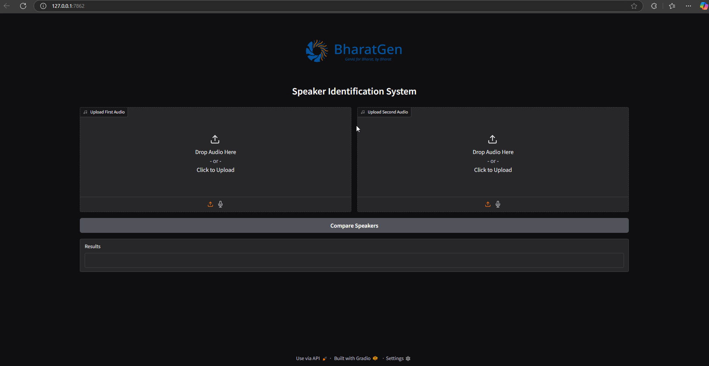

Speaker-Embedding-Using-ECAPA-TDNN
This repo contains the code for running the computing the speaker embedding using ECAPA-TDNN model.

dependencies:
```
pip install gradio torch torchaudio numpy scipy
```

